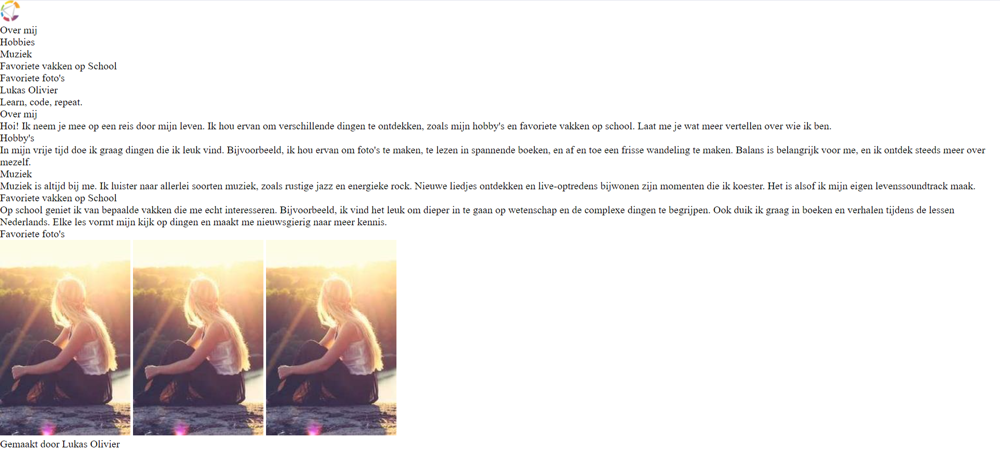
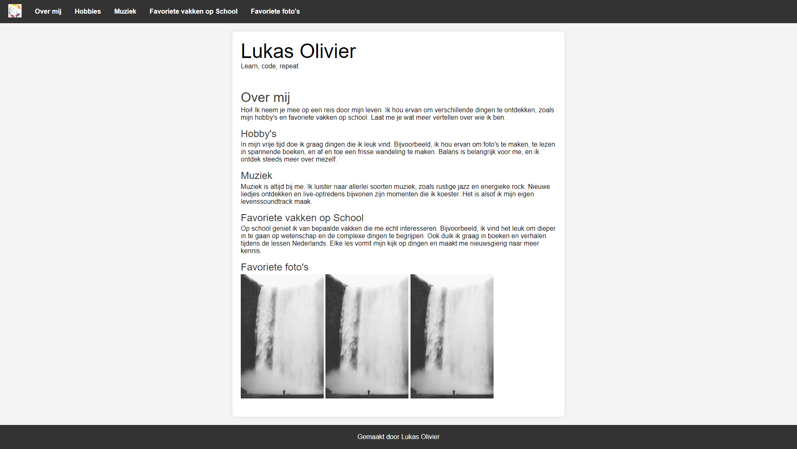

# Opdracht: maak je eigen website

## Opdracht 1: HTML

Doel:

Leer basis HTML-elementen gebruiken om een webpagina te maken.
Presenteer informatie over jezelf op een gestructureerde manier.
Voeg eenvoudige stijlelementen toe met CSS om je pagina wat op te fleuren.

Voor je begint, lees de [uitleg over HTML](Uitleg.md).

Gebruik het [voorbeeld](#voorbeeld) als inspiratie. Roep ons gerust als je vastzit 😄.

### 0. Waar begin ik?

Ga naar de `index.html` pagina. Hierin staat al een basisstructuur voor je pagina. Je hoeft hier niets aan te veranderen. Je mag beginnen met het toevoegen van elementen in de `<body>`.

### 1. Header

Voeg een `<header>` toe met een navigatiebalk (`<nav>`). De navigatiebalk moet links bevatten naar de verschillende secties van je pagina. Gebruik hiervoor een ongeordende lijst (`<ul>`) en lijstitems (`<li>`).

Zorg ervoor dat elke `<li>` telkens een anchor (`<a>`)  bevatten met een `href` attribuut dat verwijst naar de id van de sectie waarnaar gelinkt wordt. Als je hierop klikt, zal de pagina automatisch scrollen naar de sectie met de gegeven id.

Je mag de navigatiebalk ook een logo geven. Gebruik hiervoor een `` element (zorg dat deze als eerste staat in de lijst).

Voorbeeld:

```html
<nav>
  <ul>
    <li></li>
    <li><a href="#over-mij">Over mij</a></li>
    ...
  </ul>
</nav>
```

### 2. Hoofdinhoud

Voeg een `<main>` sectie toe met ten twee `<section>` elementen.

In de eerste `<section>`, presenteer je naam als `<h1>`. Voeg daarna onderstaand p element toe, dit zal met wat magie een willigkeurige quote tonen.

```html
<p id="quote">Loading...</p>
```

In de tweede `<section>` (id="over-mij"), presenteer informatie over jezelf, zoals hobby's, interesses, en favoriete vakken op school. Gebruik headers (`<h2>`, `<h3>`) en paragrafen (`<p>`).

Voeg drie afbeeldingen toe met het `` element. Gebruik de `src` attribuut om de locatie van de afbeelding op te geven. Gebruik de `alt` attribuut om een beschrijving van de afbeelding te geven.

Voorbeeld:

```html

```

### 4. Footer

Voeg een `<footer>` toe. Zet daarin een paragraaf `<p>` met als tekst 'Gemaakt door *jouw naam*.'

## Voorbeeld



---

## Opdracht 2: CSS

Doel:

Leer basis CSS-eigenschappen gebruiken om een webpagina te stylen. Het doel is om de pagina er ongeveer zo uit te laten zien als het voorbeeld hieronder.

Voor je begint, lees de [uitleg over CSS](Uitleg.md), roep ons als je vastzit, en bekijk het [voorbeeld](#voorbeeld-met-css) voor inspiratie.

### 0. Waar begin ik deze keer?

Ga naar de `assets/css/style.css` pagina. Deze keer staat er nog niets in. Je mag beginnen met het toevoegen van CSS-eigenschappen die hieronder beschreven staan.

### 1. Titelgroote aanpassen

Pas de grootte van de titels (`h1`, `h2`, `h3`) aan met de `font-size` eigenschap.

### 2. Marges toevoegen

Voeg marges toe aan de boven- en onderkant van de titel met de `margin-top` en `margin-bottom` eigenschappen.

### 3. Fotogrootte aanpassen

Pas de grootte van de foto's aan met de `width` en `height` eigenschappen.

### 4. Footer stylen

Pas de achtergrondkleur van de footer aan met de `background-color` eigenschap.
Zet de tekstkleur van de footer op wit met de `color` eigenschap.
Centreer de tekst in de footer met de `text-align` eigenschap.

### Ben je klaar?

Als je klaar bent, mag je je vrije wil loslaten op de pagina. Voeg een achtergrondafbeelding toe, verander de kleuren, voeg een border toe, the sky is the limit!

## Voorbeeld met CSS


